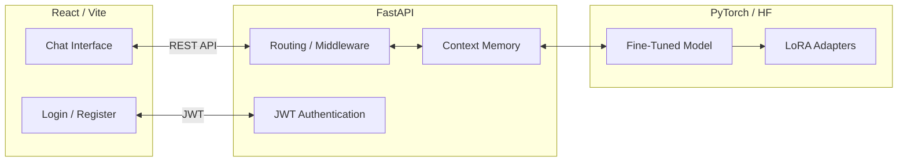

<div align="center">

# 🏥 Medical AI Assistant


<p align="center">
  A full-stack, secure, and performant AI-powered medical assistant chatbot.
</p>

[**🚀 Quick Start**](#installation) • 
[**📚 Documentation**](#api-endpoints) • 
[**🛠️ Tech Stack**](#tech-stack) • 
[**🤝 Contributing**](#contributing)

</div>

---

## 📖 Project Description

The **Medical AI Assistant** is an end-to-end full-stack application designed to answer medical queries conversationally. It utilizes a fine-tuned HuggingFace language model operating over a PyTorch/Transformers pipeline with PEFT/LoRA memory optimizations. Its frontend provides a sleek, real-time chat interface built with React and Vite, while the robust backend leverages FastAPI for token-based authentication (JWT) and high-performance, asynchronous endpoints.

**Disclaimer:** This is an AI tool and should not be used as a substitute for professional medical advice, diagnosis, or treatment.

---

## ✨ Key Features

- **🧠 Advanced LLM Integration:** Powered by HuggingFace Transformers, PEFT, and bitsandbytes for efficient inference.
- **🔒 Secure Authentication:** JWT-based user authentication using secure `passlib` bcrypt hashing.
- **💬 Contextual Memory:** Maintains conversation history dynamically to interact with the LLM accurately.
- **⚡ High Performance backend:** Built entirely on asynchronous Python using FastAPI.
- **🎨 Modern UI/UX:** A responsive frontend developed with React, Vite, and styled with Tailwind CSS.

---

## 🏗️ Project Architecture



---

## 🛠️ Tech Stack

<div align="center">
  
  <br />
  
</div>

<br />

| Category | Technologies |
| :--- | :--- |
| **Frontend** | React 18, Vite, TailwindCSS, React-Router-DOM |
| **Backend** | Python 3, FastAPI, Uvicorn, Pydantic, Passlib, Python-Jose |
| **AI / ML** | PyTorch, Transformers, PEFT, Accelerate, Bitsandbytes, Datasets |

---

## 🚀 Installation

### Prerequisites
- Python 3.10+
- Node.js 18+
- (Optional but recommended) CUDA-compatible GPU

### 1. Clone the repository
```bash
git clone https://github.com/yourusername/End-To-End-Medical_Support-Chatbot.git
cd End-To-End-Medical_Support-Chatbot
```

### 2. Setup using Quick Script (Windows)
We provide an automated batch script to install all dependencies and start the servers.
```cmd
run.bat
```

### Manual Setup

<details>
<summary><b>Backend Setup</b></summary>
<br/>

```bash
# Create Virtual Environment
python -m venv .env

# Activate (Windows)
.env\Scripts\activate

# Activate (Linux/Mac)
source .env/bin/activate

# Install Dependencies
pip install -r requirements.txt
```
</details>

<details>
<summary><b>Frontend Setup</b></summary>
<br/>

```bash
cd frontend

# Install Dependencies
npm install
```
</details>

---

## 💻 Usage

If you are not using `run.bat`, start the services manually:

**Terminal 1: Start Backend**
```bash
# Ensure your virtual environment is activated
cd backend
uvicorn main:app --reload --port 8000
```

**Terminal 2: Start Frontend**
```bash
cd frontend
npm run dev
```

Visit `http://localhost:5173` to access the chat interface!

---

## 📡 API Endpoints

The API documentation is automatically generated by FastAPI. Once the backend is running, visit:
👉 **[http://localhost:8000/docs](http://localhost:8000/docs)** (Swagger UI)

### Core Endpoints

| Method | Endpoint | Description | Auth Required |
| :--- | :--- | :--- | :---: |
| `GET` | `/` | Root API Verification | ❌ |
| `GET` | `/healthz` | Health check & UP-time monitoring | ❌ |
| `POST` | `/api/v1/login` | Authenticate user & receive JWT token | ❌ |
| `POST` | `/api/v1/register` | Register a new user | ❌ |
| `POST` | `/api/v1/chat/message`| Send query to LLM and receive response| ✅ |
| `GET` | `/api/v1/chat/history` | Retrieve context memory for user | ✅ |

---

## 📁 Project Structure

```text
End-To-End-Medical_Support-Chatbot/
├── backend/                  # FastAPI Application
│   ├── api/                  # API routers (auth, chat)
│   ├── core/                 # Core utilities & security
│   ├── schemas/              # Pydantic validation models
│   └── main.py               # Application entrypoint
├── frontend/                 # React Application
│   ├── src/                  # React components & hooks
│   ├── public/               # Static assets
│   ├── package.json          # Node dependencies
│   ├── tailwind.config.js    # Tailwind styling config
│   └── vite.config.js        # Vite build config
├── data/                     # Training data & datasets
├── models/                   # Local weights & model configurations
├── notebooks/                # Jupyter Notebooks for EDA & Training
├── requirements.txt          # Python dependencies
├── run.bat                   # Automation script for setup & launch
└── README.md                 # You are here!
```

---

## ⚙️ Environment Variables

Create a `.env` file in the root directory and populate it based on the `.env.example` structure. Expected variables may include:

```env
SECRET_KEY="your-secure-jwt-secret-key"
ALGORITHM="HS256"
ACCESS_TOKEN_EXPIRE_MINUTES=30

HF_TOKEN="your-huggingface-access-token"  # If using private repos
```

---

## 📦 Requirements / Dependencies

The following core Python dependencies drive the project backend:

| Library | Version / Pin | Purpose |
| :--- | :--- | :--- |
| `torch` | Latest | Deep learning framework |
| `transformers` | Latest | HuggingFace LLM loading |
| `peft` | Latest | Adapters / Parameter-efficient Fine Tuning |
| `bitsandbytes` | Latest | 4-bit / 8-bit model quantization |
| `fastapi` | Latest | High performance async web framework |
| `python-jose[cryptography]` | Latest | JWT generation / validation |
| `passlib[bcrypt]` | Latest | Secure password hashing |
| `bcrypt` | `==4.0.1` | Pinned for legacy passlib compatibility |

*(See [`requirements.txt`](./requirements.txt) and [`package.json`](./frontend/package.json) for the exhaustive lists).*

---

## 📝 Example Requests

### Sending a Chat Message (cURL)

```bash
curl -X 'POST' \
  'http://localhost:8000/api/v1/chat/message' \
  -H 'accept: application/json' \
  -H 'Authorization: Bearer <YOUR_JWT_TOKEN>' \
  -H 'Content-Type: application/json' \
  -d '{
  "message": "What are the common symptoms of influenza?"
}'
```

---

## 📸 Screenshots

*(Replace these placeholders with actual screenshots once deployed)*

|  |  |

---

## 🔮 Future Improvements

- [ ] Connect backend to a production database (e.g., PostgreSQL/MongoDB).
- [ ] Implement Streaming API responses (SSE) for type-writer chat effect.
- [ ] Integrate Retrieval-Augmented Generation (RAG) using vector databases.
- [ ] Dockerize both frontend and backend for unified deployment.

---

## 🤝 Contributing

Contributions are what make the open source community such an amazing place to learn, inspire, and create. Any contributions you make are **greatly appreciated**.

1. Fork the Project
2. Create your Feature Branch (`git checkout -b feature/AmazingFeature`)
3. Commit your Changes (`git commit -m 'Add some AmazingFeature'`)
4. Push to the Branch (`git push origin feature/AmazingFeature`)
5. Open a Pull Request

---

## 📄 License

Distributed under the MIT License. See `LICENSE` for more information.

<div align="center">
  <sub>Built by Syed Sarim Abbas.</sub>
</div>
